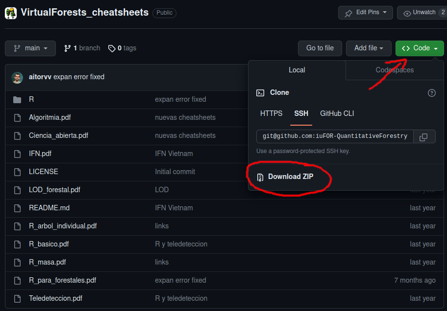

# Cheatsheets con aplicación forestal

Repositorio creado para almacenar cheatsheets del proyecto Virtual Forests y contenidos relacionados para el ámbito forestal.  

---

## Cómo Utilizar este Repositorio

Puedes consultar el contenido de este repositorio de manera online o bien descargarlo pinchando en el botón superior verde ***Código*** y a continuación seleccionando la opción ***Descargar ZIP***, tal y como se muestra a continuación:

---

## Contenido:

- [Algoritmia](https://github.com/iuFOR-QuantitativeForestry/VirtualForests_cheatsheets/blob/main/Algoritmia.pdf): conceptos básicos sobre algoritmia
- [Ciencia_abierta](https://github.com/iuFOR-QuantitativeForestry/VirtualForests_cheatsheets/blob/main/Ciencia_abierta.pdf): conceptos básicos sobre la ciencia abierta
- [IFN](https://github.com/iuFOR-QuantitativeForestry/VirtualForests_cheatsheets/blob/main/IFN.pdf): información básica acerca de los Inventarios Forestales Nacionales de España, Argentina, Colombia y Vietnam
- [LOD_forestal](https://github.com/iuFOR-QuantitativeForestry/VirtualForests_cheatsheets/blob/main/LOD_forestal.pdf): conceptos básicoa de LOD (Linked Open Data - datos abiertos enlazados) aplicados al sector forestal
- [R_basico](https://github.com/iuFOR-QuantitativeForestry/VirtualForests_cheatsheets/blob/main/R_basico.pdf): comandos básicos para iniciarse en el uso de R
- [R_arbol_individual](https://github.com/iuFOR-QuantitativeForestry/VirtualForests_cheatsheets/blob/main/R_arbol_individual.pdf): código de R útil para realizar cálculos a nivel de árbol individual
- [R_masa](https://github.com/iuFOR-QuantitativeForestry/VirtualForests_cheatsheets/blob/main/R_masa.pdf): código de R útil para realizar cálculos de nivel de masa forestal
- [R_para_forestales](https://github.com/iuFOR-QuantitativeForestry/VirtualForests_cheatsheets/blob/main/R_para_forestales.pdf): código de R para cálculos de árbol individual y masa preparado para ser empleado en R (ver carpeta [**R**](https://github.com/iuFOR-QuantitativeForestry/VirtualForests_cheatsheets/tree/main/R))
- [Teledetección](https://github.com/iuFOR-QuantitativeForestry/VirtualForests_cheatsheets/blob/main/Teledeteccion.pdf): comandos de Python útiles para iniciarse en el uso de teledetección utilizando Google Earth Engine
  
Además, la carpeta [**R**](https://github.com/iuFOR-QuantitativeForestry/VirtualForests_cheatsheets/tree/main/R) contiene un script de R (formato RMarkdown) con unos datos de ejemplo sobre los que se pueden aplicar los comandos recogidos en las cheatsheets **R_arbol_individual** y **R_masa**.

---

